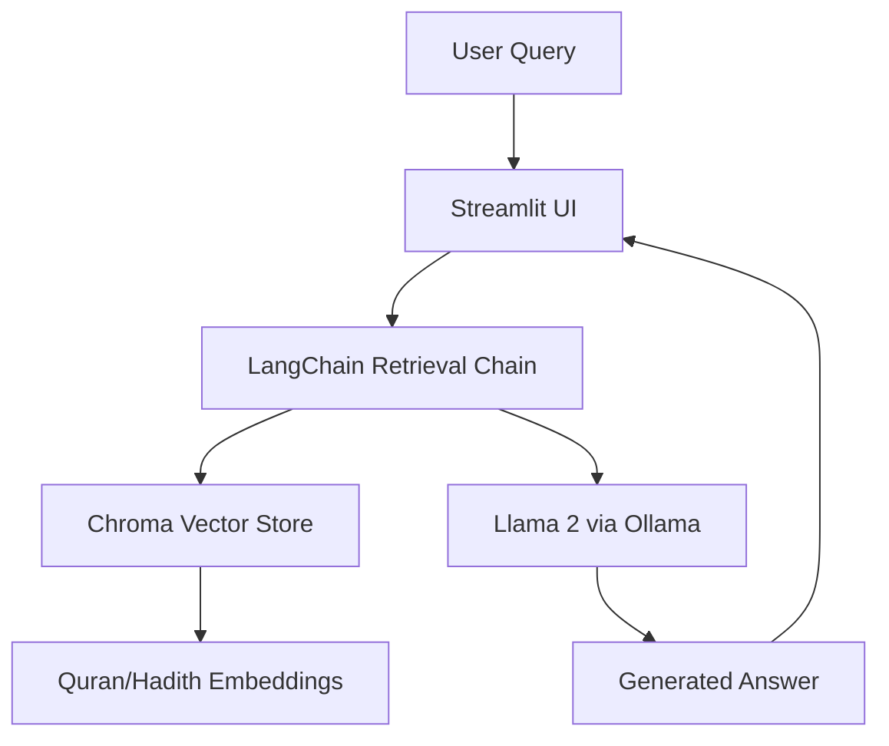

# 🕌 Quran RAG Assistant

> **Ask, learn, and explore Quranic wisdom — powered by local AI.**

Quran RAG Assistant is a **Retrieval-Augmented Generation (RAG)** application that allows users to ask natural-language questions about the **Quran** and **Hadith** — running **fully offline** on your local machine.

Built with **Llama 2**, **LangChain**, **ChromaDB**, and **Streamlit**, this project combines modern AI retrieval techniques with a simple, privacy-first interface for Islamic knowledge exploration.

---

## 🪶 Features

- 📂 **Upload your own Quranic or Hadith text files**
- 🧠 **Retrieval-Augmented Generation (RAG)** for accurate, context-aware answers
- 💬 **Ask questions** like “What does the Quran say about patience?”
- 🔒 **Offline-first** — runs locally via Ollama (no cloud calls)
- ⚡ **Fast setup** with Streamlit and LangChain
- 🕌 **Faith-friendly AI assistant** — always cites from your uploaded text

---

## 🧰 Tech Stack

| Layer | Technology |
|-------|-------------|
| **Frontend (UI)** | Streamlit |
| **LLM Backend** | Ollama (Llama 2) |
| **Retrieval Engine** | LangChain |
| **Vector Store** | ChromaDB |
| **Embeddings** | HuggingFace `all-MiniLM-L6-v2` |

---

## 🧩 Architecture Overview



---

## 🚀 Getting Started

### 1. Clone the Repository
```bash
git clone https://github.com/yourusername/quran-rag-assistant.git
cd quran-rag-assistant
```

### 2. Create a Virtual Environment (optional but recommended)
```bash
python -m venv venv
source venv/bin/activate  # for macOS/Linux
venv\Scripts\activate     # for Windows
```

### 3. Install Dependencies
```bash
pip install -r requirements.txt
```

### 4. Set Up Ollama and Llama 2
Install Ollama and pull the Llama 2 model locally:
```bash
ollama pull llama2
```

### 5. Run the Streamlit App
```bash
streamlit run app.py
```

### 6. Build Your Knowledge Base
Upload a `.txt` file containing Quranic or Hadith content, or use the included default Quran file.

---

## 💡 Example Usage

**Query:**  
> “What does the Quran say about patience?”

**Answer:**  
> “The Quran emphasizes patience as a virtue in adversity. Allah is with those who are patient (Surah Al-Baqarah 2:153).”

---

## 📸 Screenshots

| Home Page | Question Answer Example |
|------------|-------------------------|
|  |  |

---

## 🤝 Contributing

Contributions are welcome!  
Here’s how you can help:
1. Fork the repository  
2. Create a new branch (`feature/your-feature-name`)  
3. Commit your changes  
4. Push to your fork and open a Pull Request  

Please ensure your code follows existing style and adds meaningful improvements.

---

## 📜 License

This project is released under the **MIT License**.  
See the [LICENSE](LICENSE) file for details.

---

## ⚖️ Disclaimer

This project is for **educational and research purposes only**.  
While the assistant references Quranic and Hadith texts, its responses are generated by an AI model and should **not** be considered authoritative religious rulings.

---

## 🌟 Acknowledgements

- [LangChain](https://www.langchain.com/)  
- [Ollama](https://ollama.ai)  
- [ChromaDB](https://www.trychroma.com/)  
- [Streamlit](https://streamlit.io/)  
- [HuggingFace](https://huggingface.co/)  
